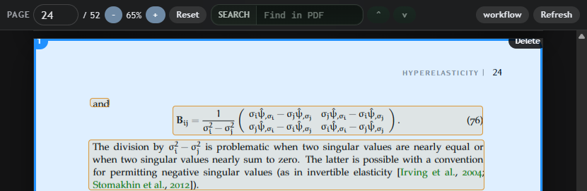
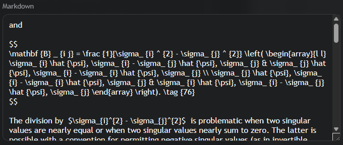
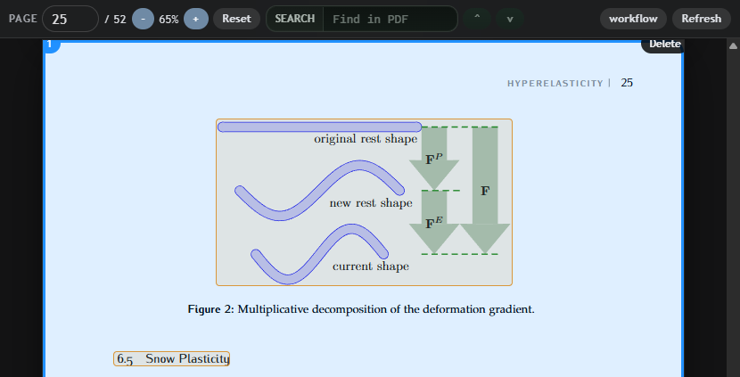
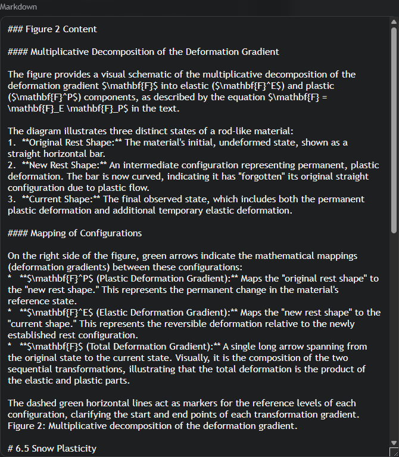
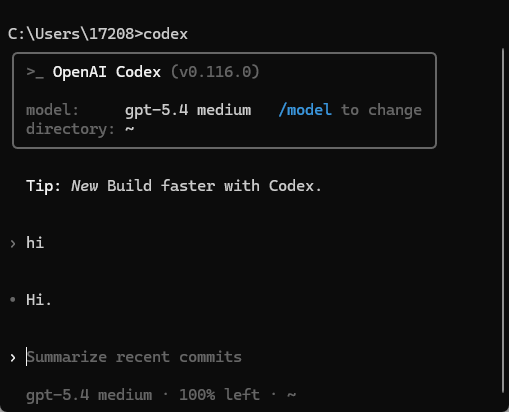

# Exocortex: 深度阅读与知识内化的论文阅读器

### 数学公式转为latex代码：

### 图片转为文本描述：

## 前言

这是一个基于 **[Codex](https://github.com/openai/codex)** 构建的论文/书籍阅读器

在传统的 LLM 辅助阅读场景中，我们经常面临着“碎片化交互”的困境：网页端的线性对话窗口不仅难以维持长文档的上下文，更难以将 AI 产生的洞见与原文建立结构化的持久联系。当阅读一篇充满公式和图表的理工科论文时，单纯的 OCR 文本丢失了排版语义，而反复的上下文翻阅则打断了心流。

**Exocortex** 正是为了解决这一痛点而生。

## 特性

#### 万物皆markdown：

无论是图片、公式，都转化为llm友好的markdown纯文本

#### 多层级上下文：

我还在想怎么吹

---
## 快速开始

### 1.codex的准备
* 确保 **[Codex](https://github.com/openai/codex)** 在你的系统环境可以在terminal中正常调用。

  

### 2.下载[Exocortex](https://github.com/ximiwu/Exocortex/releases)
